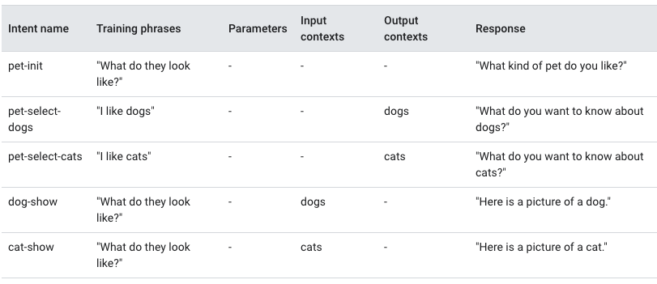

## Dialogflow ES basics
* A Dialogflow agent is a virtual agent that handles conversations with your end-users.
* An intent categorizes an end-user's intention for one conversation turn.
* A basic intent contains training phrases, action (for each intent), parameters and responses

### Agent
* A Dialogflow agent translates end-user text or audio during a conversation to structured data that your apps and services can understand.
* An intent categorizes an end-user's intention for one conversation turn.
   * For each agent, you define many intents, where your combined intents can handle a complete conversation.
   * When an end-user writes or says something, referred to as an end-user expression, Dialogflow matches the end-user expression to the best intent in your agent.
   * Matching an intent is also known as intent classification.

### Intent
A basic intent contains the following:
* __Training phrases__: These are example phrases for what end-users might say. When an end-user expression resembles one of these phrases, Dialogflow matches the intent.
* __Action__: You can define an action for each intent. When an intent is matched, Dialogflow provides the action to your system, and you can use the action to trigger certain actions defined in your system.
* __Parameters__: When an intent is matched at runtime, Dialogflow provides the extracted values from the end-user expression as parameters.
  * Each parameter has a type, called the __entity type__, which dictates exactly how the data is extracted.
  * Dialogflow provides predefined system entities that can match many common types of data.
    * For example, there are system entities for matching dates, times, colors, email addresses, and so on.
    * You can also create your own custom entities for matching custom data
  * Parameters are structured data that can easily be used to perform some logic or generate responses.
* __Responses__: You define text, speech, or visual responses to return to the end-user. These may provide the end-user with answers, ask the end-user for more information, or terminate the conversation.

#### More on entities
The term entity is used to describe the general concept of entities.

__Entity type__: Defines the type of information you want to extract from user input. For example, vegetable could be the name of an entity type. Clicking Create Entity from the Dialogflow Console creates an entity type. When using the API, the term entity type refers to the EntityType type.

__Entity entry__: For each entity type, there are many entity entries. Each entity entry provides a set of words or phrases that are considered equivalent. For example, if vegetable is an entity type, you could define these three entity entries:
```
carrot
scallion, green onion
bell pepper, sweet pepper
```
When editing an entity type from the Dialogflow Console, each row of the display is an entity entry. When using the API, the term entity entry refers to the Entity type (```EntityType.Entity``` or ```EntityType_Entity``` for some client library languages).

Entity reference value and synonyms: Some entity entries have multiple words or phrases that are considered equivalent, like the scallion example above. For these entity entries, you provide one reference value and one or more synonyms.

### Contexts
Dialogflow contexts are similar to natural language context. If a person says to you "they are orange", you need context in order to understand what "they" is referring to. Similarly, for Dialogflow to handle an end-user expression like that, it needs to be provided with context in order to correctly match an intent.

You can configure contexts for an intent by setting input and output contexts, which are identified by string names. When an intent is matched, any configured output contexts for that intent become active. While any contexts are active, Dialogflow is more likely to match intents that are configured with input contexts that correspond to the currently active contexts


### Follow up intent
You can use follow-up intents to automatically set contexts for pairs of intents. A follow-up intent is a child of its associated parent intent. When you create a follow-up intent, an output context is automatically added to the parent intent and an input context of the same name is added to the follow-up intent.

A follow-up intent is only matched when the parent intent is matched in the previous conversational turn. You can also create multiple levels of nested follow-up intents.

Dialogflow provides many predefined follow-up intents for common end-user replies like "yes", "no", or "cancel". You can also create your own follow-up intents to handle custom replies

### Dialogflow Console
Dialogflow provides a web user interface called the Dialogflow Console to create, build, and test agents.


### Integration vs. API
#### Integration
Dialogflow integrates with many popular conversation platforms and if an integration is used, direct end-user interactions are handled.
When you enable fulfillment for an intent, Dialogflow responds to that intent by calling a service that you define.
* Each intent has a setting to enable fulfillment.
* If an intent requires some action by your system or a dynamic response, you should enable fulfillment for the intent.
* If an intent without fulfillment enabled is matched, Dialogflow uses the static response you defined for the intent.
* When an intent with fulfillment enabled is matched, Dialogflow sends a request to the selected webhook service with information about the matched intent. The system can perform any required actions and respond to Dialogflow with information for how to proceed.

The resulting flow is as follows:
* The end-user types or speaks an expression.
* Dialogflow matches the end-user expression to an intent and extracts parameters.
* Dialogflow sends a webhook request message to the webhook service which performs the action and then sends a webhook response message to Dialogflow which sends the response to the end-user.
* The end-user sees or hears the response.


#### API
Without an integration, the programmer has to write the code  that interacts with both the end user and the Diaglogflow API
* The end-user types or speaks an expression which is sent to Dialogflow in a detect intent request message.
* This message contains information about the matched intent, the action, the parameters, and the response defined for the intent.
* The service performs actions as needed, like database queries or external API calls.
* The service sends a response to the end-user.


### Interactions with the API
#### Sessions
A ___session___ represents a conversation between a Dialogflow agent and an end-user.
* Each session is determined unique by a session ID generated by your system.
* You create a new session by providing a new session ID in a detect intent request.
* A session ID is a string of at most 36 bytes in size. Your system is responsible for generating unique session IDs.

#### Detect intent
When you use the API for interactions, your service interacts directly with the end-user. For each conversational turn, your service sends end-user expressions to Dialogflow by calling the ```detectIntent``` or ```streamingDetectIntent``` method of the Sessions type.

Dialogflow responds with information about the matched intent, the action, the parameters, and the response defined for the intent. Your service performs actions as needed (for example, database queries or external API calls) and sends a message to the end-user. This process continues until the conversation has ended.

The following samples show how to detect intent. Each sample accepts a subset of the following inputs:

___Project ID___: Use the project ID for the project you created in the setup steps.

___Session ID___: For the purpose of testing an agent, you can use anything. For example, "123456789" is frequently used by samples.

___Text or texts___: This is the single end-user expression or list of end-user expressions. If multiple expressions are supplied, the sample code calls detect intent for each expression. Try using "I know french".

___Language code:___ The language code for the end-user expression. Use "en-US" for this example agent.

```python
def detect_intent_texts(project_id, session_id, texts, language_code):
    """Returns the result of detect intent with texts as inputs.

    Using the same `session_id` between requests allows continuation
    of the conversation."""
    import dialogflow_v2 as dialogflow
    session_client = dialogflow.SessionsClient()

    session = session_client.session_path(project_id, session_id)
    print('Session path: {}\n'.format(session))

    for text in texts:
        text_input = dialogflow.types.TextInput(
            text=text, language_code=language_code)

        query_input = dialogflow.types.QueryInput(text=text_input)

        response = session_client.detect_intent(
            session=session, query_input=query_input)

        print('=' * 20)
        print('Query text: {}'.format(response.query_result.query_text))
        print('Detected intent: {} (confidence: {})\n'.format(
            response.query_result.intent.display_name,
            response.query_result.intent_detection_confidence))
        print('Fulfillment text: {}\n'.format(
            response.query_result.fulfillment_text))
```

### Editions
* __Dialogflow Trial Edition__	A free edition that provides most of the features of the standard ES agent type. It offers limited quota and support by community and e-mail. This edition is suitable to experiment with Dialogflow.
* __Dialogflow ES Edition__	The Dialogflow Essentials (ES) Edition is a pay-as-you-go edition that provides the standard ES agent type. The Essentials Edition offers production-ready quotas and support from Google Cloud support.
* __Dialogflow CX Edition__	The Dialogflow Customer Experience (CX) Edition is a pay-as-you-go edition that provides the advanced CX agent type. The CX Edition offers production-ready quotas and support from Google Cloud support.

## Getting started links
* The Google Cloud Console (visit documentation, open console) is a web UI used to provision, configure, manage, and monitor systems that use Google Cloud products.
* You use the Google Cloud Console to set up and manage Dialogflow resource
* To use services provided by Google Cloud, you must create a project.
[Google Cloud Documentation](https://support.google.com/cloud/answer/3465889?hl=en&ref_topic=3340599)
[Open GCC console](https://console.cloud.google.com/?_ga=2.252287552.83937720.1604759988-1790567636.1602529352)
[Dialogflow ES Console Documentation](https://cloud.google.com/dialogflow/docs/console)
[Open Dialogflow ES Console](https://dialogflow.cloud.google.com/) this will create a basic starter agent but only for use with an integration (and not the API)
[Quickstart Setup](https://cloud.google.com/dialogflow/es/docs/quick/setup)
